# Running a Proof of Authority Blockchain

The Proof of Authority (PoA) algorithm is typically used for private blockchain networks as it requires pre-approval of, or voting in of, the account addresses that can approve transactions (seal blocks).  

# Blockchain Installation Guide

**Important Note:** Windows users **MUST** use `git-bash` and not the default Windows command prompt when you are requested to open the terminal window to execute commands.

## Installing MyCrypto Desktop App

[MyCrypto](https://www.mycrypto.com/) is a free, open-source, client-side interface that allows you to interact directly with the blockchain.

Feel free to use MyCrypto Desktop App to manage ethereum wallets and make transactions in the blockchain.

To install MyCrypto Desktop App, please follow the next steps:

1. Open your browser and navigate to the downloads page at https://download.mycrypto.com/.

 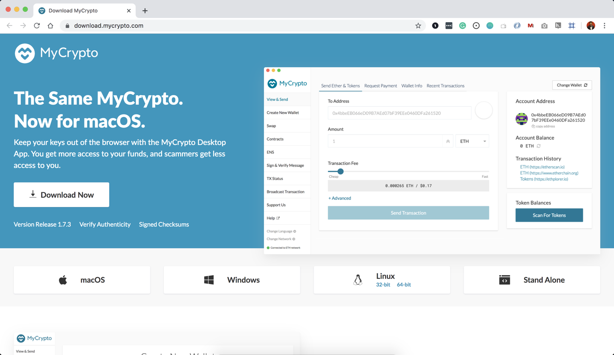

2. Depending on your operating system, you will be redirected to the corresponding application installer. If you are not correctly redirected, choose the appropriate installer for your operating system.

3. Once you download the installer, open the file, and follow the installation wizard. You will start using this application on Day 1.

### MyCrypto Installation Notes

General Notes:

* The first time you execute MyCrypto, you will see the following starting tutorial, I suggest to read trough as you click "Next" to continue.

 

Running in OS X:

* The first time you execute MyCrypto, you will see the following warning message, you can safely click on the "Open" button to start the application.

 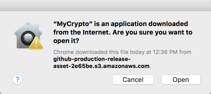

### Allowing Permission to Open Apps from Unidentified Developers

When an app is not registered with Apple, it can be automatically blocked by the Mac OS operating system when attempting to open the "unidentified" application. Therefore, in order to allow the use of the MyCrypto app, you may need to allow it as an exception to your Mac OS security preferences. To do so perform the following.

1. Open the MyCrypto app, it should produce a warning error saying that you cannot open the application due to security reasons. Therefore, we'll need to make a security exception for it.

2. Look to the top-left of the screen and click on the Apple Logo and navigate to System Preferences > Security & Privacy.

    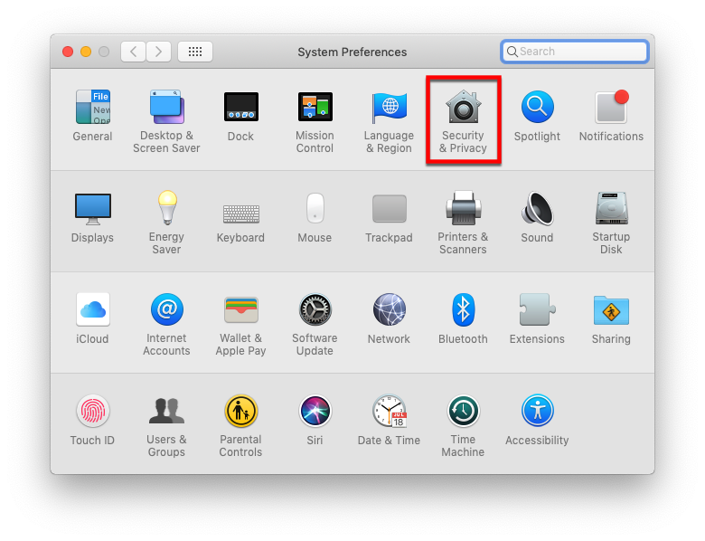

3. Click in the General tab and allow your MyCrypto application security access to be opened in the "Allow Apps Downloaded From" section. Your screen should look similar to the image below.

    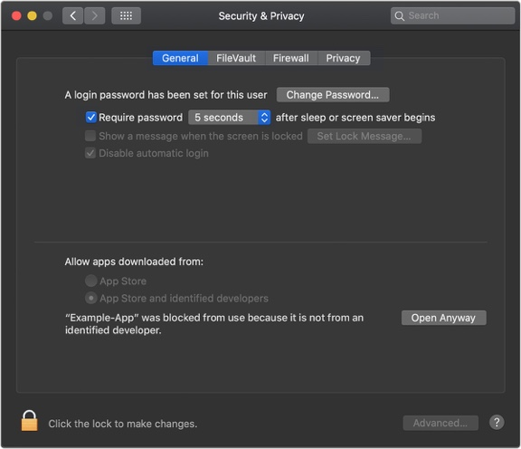

## Installing Go Ethereum Tools

[Go Ethereum](https://geth.ethereum.org/) is one of the three original implementations of the Ethereum protocol. It is written in Go, fully open-source and licensed under the GNU LGPL v3.

I will use Go Ethereum Tools to create my own blockchain, from the genesis block to mining tokens and making transactions.

Despite there are installers for OS X and Windows, I will use the application executable binary files to have a seamless experience between both operating systems and avoid some technical issues that currently exist in Windows.

To install the Go Ethereum Tools, please follow the next steps:

1. Open your browser and navigate to the Go Ethereum Tools download page at https://geth.ethereum.org/downloads/

2. Scroll down to the "Stable Releases" section and proceed depending on your operating system.

 2.1. Installing in OS X.
 Click on the **"Geth & Tools 1.9.7"** to download the applications bundle archive.
 

 2.2. Installing in Windows.
 
 You need to know if you are running a `32 bit` or `64 bit` version of Microsoft Windows, if you are not sure about that, you can check your version following [these steps](https://support.microsoft.com/en-us/help/13443/windows-which-version-am-i-running).

 Depending on your Windows version, you should download the `32 bit` or `64 bit` version of the Go Ethereum Tools.

3. After downloading the tools archive, open your "Downloads" folder, and you will find a file named `geth-alltools-darwin-amd64-1.9.7-a718daa6.tar.gz` in OS X, and a file called `geth-alltools-windows-amd64-1.9.7-a718daa6.zip` in Windows. Note that the last numbers in the filename could vary depending on the last built available.

4. Decompress the archive in the location of your preference in your computer's hard drive, and rename the containing folder as `Blockchain-Tools`. I recommend using a location that can be easily accessed from the terminal window like the user's home directory.

 

 ### Let's Start it. 

1. Open your Terminal and navidate to a folder `Blockchain-Tools`. Switch from base to ethereum environment (`conda activate ethereum`). After, you will generate two new nodes with new account addresses that will serve as our pre-approved sealer addresses.

    * Create accounts for two nodes for the network with a separate `datadir` for each using `geth`:

        * ./geth --datadir node1 account new (it will give you 'Public address of the key: 0x7D4247280Fb0090548FC66FD8d51090De4F1b0a4' and 'Path of the secret key file'. Save both in a notebook for your reference. You will need a "Public address" later.)
        * ./geth --datadir node2 account new (it will give you 'Public address of the key': 0x7Bb859b0acAD412c747292d027B7A4659e9191D6 and 'Path of the secret key file'. Save both in a notebook for your reference. You will need a "Public address" later.)

2. Next, generate your genesis block.

    * Run `./puppeth` command in your Terminal, name your network (in my case, I named it "ubernet"), and select the option to configure a new genesis block. 

    * Choose the `Clique (Proof of Authority)` consensus algorithm.

    * Paste both account addresses from the first step one at a time into the list of accounts to seal (see above for the addresses).

    * Paste them again in the list of accounts to pre-fund. There are no block rewards in PoA, so you'll need to pre-fund.

    * You can choose `no` for pre-funding the pre-compiled accounts (0x1 .. 0xff) with wei. This keeps the genesis cleaner.

    * Add Chain ID. It can be any random number. In my case: 999.

    * Complete the rest of the prompts, and when you are back at the main menu, choose the "Manage existing genesis" option.

    * Export genesis configurations. This will fail to create two of the files, but you only need `ubernet.json`.

3. With the genesis block creation completed, you will now initialize the nodes with the genesis' json file.

    * Using `geth`, initialize each node with the new `ubernet.json`.
        * ./geth --datadir node1 init ubernet.json
        * ./geth --datadir node2 init ubernet.json

4. Now the nodes can be used to begin mining blocks.

    * Run the nodes in separate terminal windows with the commands:
        *  ./geth --datadir node1 --unlock "0x7D4247280Fb0090548FC66FD8d51090De4F1b0a4" --mine --rpc --allow-insecure-unlock
        *  ./geth --datadir node2 --unlock "0x7Bb859b0acAD412c747292d027B7A4659e9191D6" --mine --port 30304 --bootnodes "enode://SEALER_ONE_ENODE_ADDRESS@127.0.0.1:30303" --ipcdisable --allow-insecure-unlock 
    * **NOTE:** Type your password and hit enter - even if you can't see it visually or trying adding --password pw.txt and saving an actual passwrod in txt file in the `Blockchain-Tools` folder. 
    * **NOTE:** Add --syncmode full and/or --minerthreads  if your are having trouble with nodes mining. 

5. Now yoour private PoA blockchain should now be running!

6. With both nodes up and running, the blockchain can be added to MyCrypto for testing.

    * Open the MyCrypto app on your desktop, then click `Change Network` at the bottom left:

    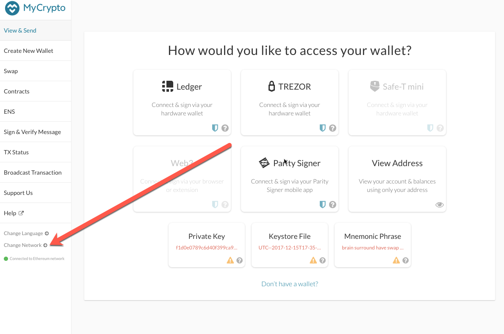

    * Click "Add Custom Node", then add the custom network information that you set in the genesis.

    * Make sure that you scroll down to choose `Custom` in the "Network" column to reveal more options like `Chain ID`. In my case, my chain id was 999:

    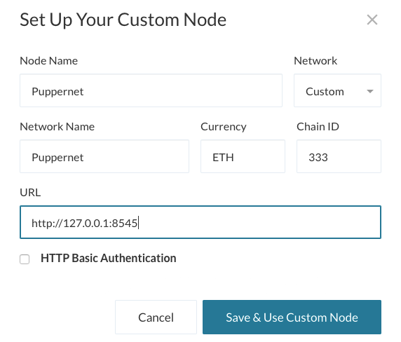

    * Type `ETH` in the Currency box.
    
    * In the Chain ID box, type the chain id you generated during genesis creation.

    * In the URL box type: `http://127.0.0.1:8545`.  This points to the default RPC port on your local machine.

    * Finally, click `Save & Use Custom Node`. 

7. After connecting to the custom network in MyCrypto, it can be tested by sending money between accounts.

    * Select the `View & Send` option from the left menu pane, then click `Keystore file`.

    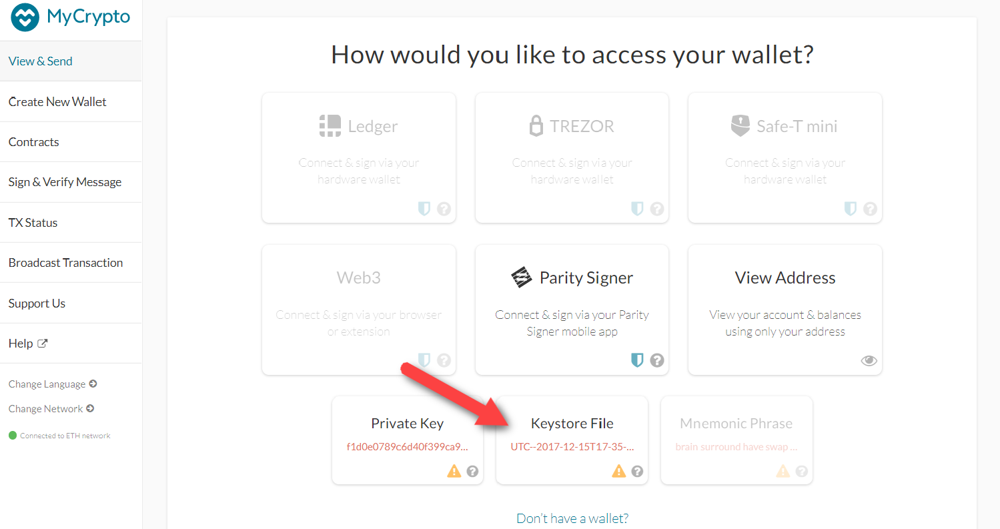

    * On the next screen, click `Select Wallet File`, then navigate to the keystore directory inside your Node1 directory, select the file located there, provide your password when prompted and then click `Unlock`.

    * This will open your account wallet inside MyCrypto. 
    
    * Looks like we're filthy rich! This is the balance that was pre-funded for this account in the genesis configuration; however, these millions of ETH tokens are just for testing purposes. 

    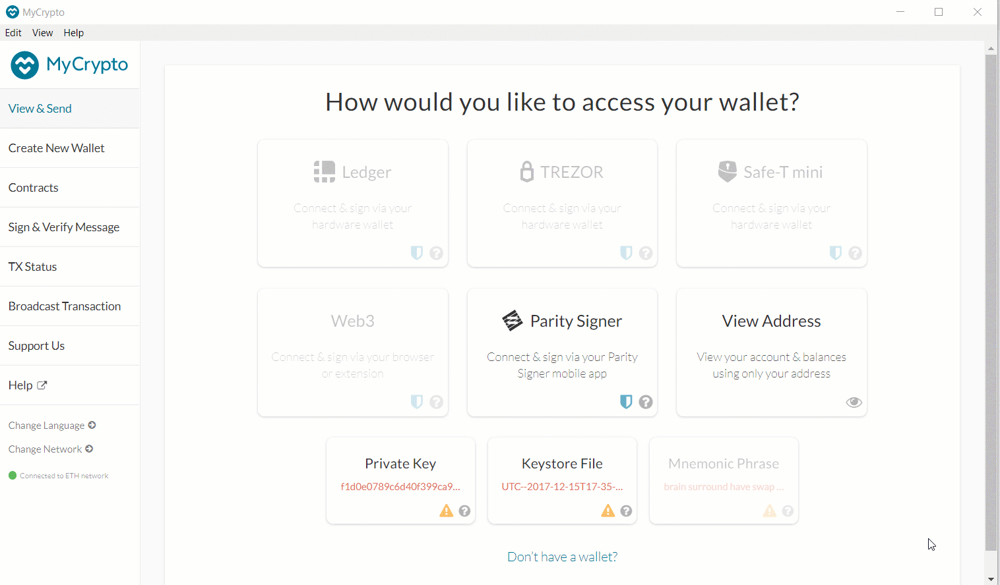

    * In the `To Address` box, type the account address from Node2, then fill in an arbitrary amount of ETH:

     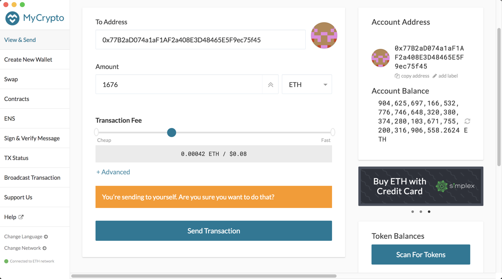

    * Confirm the transaction by clicking "Send Transaction", and the "Send" button in the pop-up window.  

    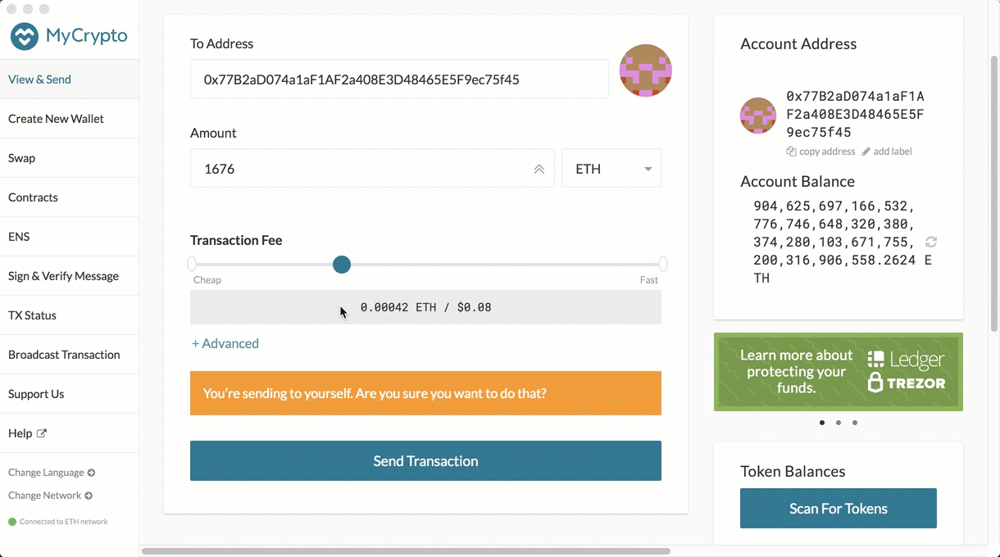

    * Click the `Check TX Status` when the green message pops up, confirm the logout:

    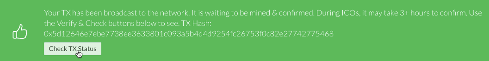

    * You should see the transaction go from `Pending` to `Successful` in around the same blocktime you set in the genesis.

    * You can click the `Check TX Status` button to update the status.

    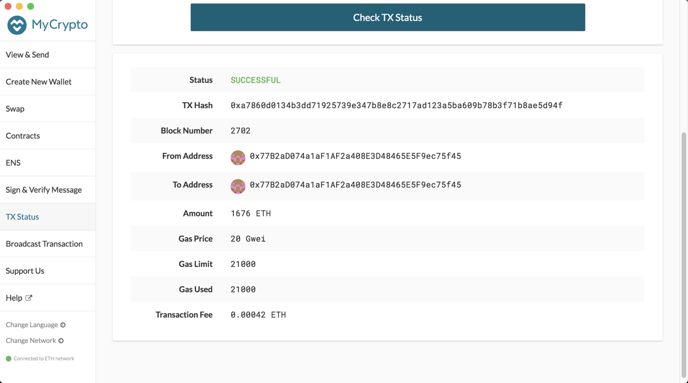

# Blockchain Terminology Guide

This guide serves as an overview for the various concepts required to understand the fundamentals of blockchain networks.

## Terminologies

* What is a blockchain?

  **Answer:** A blockchain is a network of nodes or machines linked in a peer-to-peer fashion that facilitates transactions in a verifiable and permanent way. A blockchain network is also often called an open distributed ledger.

* What is a blockchain node?

  **Answer:** A node is a single machine that contributes to the infrastructure of a blockchain network. Blockchains networks as a whole are composed of multiple nodes that are interconnected with each other and therefore exchange the latest blockchain data with each other so that each node is up-to-date with the latest verified transactions on the blockchain network.

* What is blockchain mining?

  **Answer:** Blockchain mining is the process of adding verified transaction records to the current blockchain data; miners act as separate nodes that are paid a fee to verify blockchain transactions and do so by solving intense computations to finalize transactions.

* What is a blockchain wallet?

  **Answer:** A blockchain wallet is a digital wallet containing a public and private key that is used to not only store cryptocurrencies, but also conduct secure transactions amongst other users via wallet addresses (hashed version of a public key). It is imperative that the private key for a digital wallet be kept safe, as losing it will be prevent a user from accessing their funds (no other way for decryption).

* What is Ethereum?

  **Answer:** Ethereum is an open software platform based on blockchain technology that enables developers to build and deploy decentralized applications.

* What is a hash?

  **Answer:** A hash value is a product of a function that converts an input of letters and numbers into an encrypted output of a fixed length. Hashing is one way to enable security during message transmission when the message is intended for a particular recipient only, ensuring that the message has not been tampered with, as doing so would generate a new hash value different from the originating hash value.

* What is a digital signature?

  **Answer:** A digital signature is a numerical value that is represented as a sequence of characters and is the product of ensuring the contents of a message have not been altered in transit (integrity), that the message was indeed sent by the sender (authentication), and that the sender cannot deny having sent the message (non-repudiation).

* What is encryption?

  **Answer:** Encryption is the process in which a message is encoded in a format that cannot be read or understood by an external party lacking the necessary credentials.

* What is symmetric encryption?

  **Answer:** Symmetric encryption is the simplest type of encryption that uses only a single key (a private/secret key) to both encrypt and decrypt information. As a result, the parties communicating via symmetric encryption must exchange the secret key so that it can be used in the decryption process, which is a security disadvantage compared to asymmetric encryption.

* What is an asymmetric key?

  **Answer:** Asymmetric encryption uses a key pair: a public and private key. As the name suggests, the public key is made freely available to anyone on the Internet while the private key is kept a secret by the end-user. Therefore, messages that are encrypted using the public key can only be decrypted using the associated private key, and messages that are encrypted using the private key can only be decrypted using the associated public key.

* What are the advantages vs. disadvantages of both types of encryption techniques?

  **Answer:** Symmetric encryption is the oldest and best-known technique for encryption; however, because of its use of only a single key (the private/secret key), there is the potential for a breach in security when exchanging the private key between two parties, especially over a vast network such as the Internet with possible eavesdroppers. In contrast, due to the use of a key pair in asymmetric encryption (public and private key), the private key is never exchanged and therefore is kept a secret at all times. Though as a result of the use of a key pair, asymmetric encryption is slower than symmetric encryption due to the increased processing power used to encrypt and decrypt messages.

* What is a consensus algorithm?

  **Answer:** A consensus algorithm is a protocol used to verify the validity of transactions on a blockchain network. Due to the decentralized nature of the blockchain network, there is no central authority and therefore nodes within the blockchain network must be able to verify such transactions with certainty.

* What is proof of authority?

  **Answer:** Proof of Authority (PoA) is a reputation-based consensus algorithm in which the model relies on a limited number of block validators that act as moderators to verify the newest blocks and transactions.

* What is proof of work?

  **Answer:** Proof of Work (PoW) is an asset-based consensus algorithm in which the model relies on producing a piece of data which is both resource (computation) and time intensive, but allows for others to verify the validity of the transaction. This consensus algorithm directly relates to the blockchain mining concept in which miners solve intense computations to finalize transactions.

* What is proof of stake?

  **Answer:** Proof of Stake (PoS) is an collateral-based consensus algorithm in which the model relies on transactional validators whom are selected based on the amount of Bitcoin or Ether they hold. When they validate transactions, they put up a stake of their own Bitcoin or Ether and are rewarded (proportional to their stake) when a new block or transaction is added to the blockchain.

## Helpful Links

Blockchain

* https://www.investopedia.com/terms/b/blockchain.asp

Nodes

* https://medium.com/coinmonks/blockchain-what-is-a-node-or-masternode-and-what-does-it-do-4d9a4200938f

Blockchain Wallets

* https://www.investopedia.com/terms/b/blockchain-wallet.asp

* https://blog.unocoin.com/what-happens-if-you-forget-your-bitcoin-wallet-keys-bbf563ce281a

Digital Signature

* https://www.instantssl.com/digital-signature

* https://medium.com/@xragrawal/digital-signature-from-blockchain-context-cedcd563eee5

Hash

* https://www.investopedia.com/terms/h/hash.asp

Blockchain Mining

* https://www.bitcoinmining.com/

Consensus Algorithms

* https://www.binance.vision/blockchain/what-is-a-blockchain-consensus-algorithm

Proof of Authority

* https://www.binance.vision/blockchain/proof-of-authority-explained

Proof of Work

* https://en.bitcoin.it/wiki/Proof_of_work

Proof of Stake

* https://www.investopedia.com/terms/p/proof-stake-pos.asp

